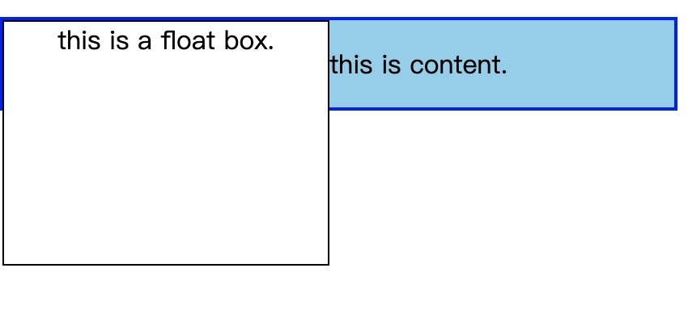
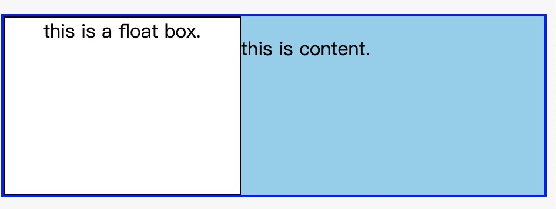
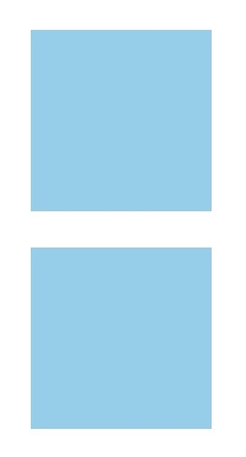

# BFC what? & how?

## 什么是 BFC？

BFC（Block Formatting Context): 块格式化上下文。引用 MDN 上的定义`是web页面的可视化css渲染的一部分，是块盒子的布局过程发生的区域，也是浮动元素与其他元素交互的区域。`，可以理解为，BFC 是一个隔离的独立容器，这个容器里的元素不会在布局上影响到外面的元素，并具有一些特性。

## 怎么生成 BFC？

- 根元素（`<html>`)
- 浮动元素
- 绝对定位元素（`position: absolute`或`fixed`）
- `display: inline-block`
- `overflow`值不为`visible` 即（`hidden`、`auto`、`scroll`）
- `display: flex`
- 表格单元格、表格标题、匿名表格单元格元素

块格式化上下文包含创建他的元素内部的所有内容。

## BFC 的特性与应用

### 1. 让浮动内容与周围的内容等高（清除浮动）

这个例子中，我们让`.float`元素浮动，`.wrap`元素的内容已经在浮动元素的周围浮动起来，因为浮动元素比其他元素高，所以浮动元素超出了外部的`div`，脱离了文档流。[在此查看实例代码](http://js.jirengu.com/wofuwugopo/1/watch?html,css,output)

要想使得`.wrap`元素能包含浮动元素，也就是我们常说的清除浮动，达到如此效果：

想要创建一个会包含这个浮动的 BFC，通常的做法是设置`.wrap`元素`overflow: hidden`或`overflow: auto`。[在此处查看更新后的实例代码](http://js.jirengu.com/wugah/2/watch?html,css,output)

### 2. 外边距折叠

我们都知道在正常的文档流中，会出现外边距折叠的现象。在同一个 BFC 下的元素也会产生外边距折叠。但是 BFC 的特性之一便是 BFC 是一个独立的容器，也就不会影响到容器外的元素，所以创建两个不同的 BFC 可以解决外边距折叠的问题。[在此处查看代码](http://js.jirengu.com/jesut/1/watch?html,css,output)
外边距塌陷：

去除外边距塌陷：

