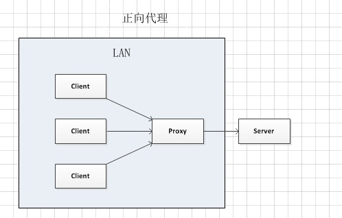
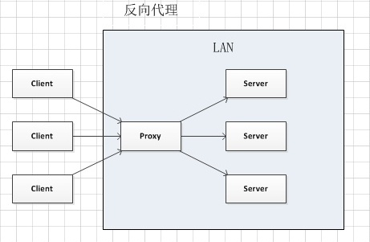

## 正向代理

**一个位于客户端与原始服务器（origin server）之间的服务器，客户端想要从原始服务器上获取内容，则需要向代理发送一个指定目标（原始服务器）的请求，然后代理再向原始服务器转发请求并获得内容返回给客户端。**

当然，客户端想要设置正向代理服务器，前提是要知道代理服务器的 ip 地址以及代理程序的端口号。
怎么样去理解呢？举一个例子：
::: tip 例子：
你有一个项目需要投资一个亿，但是你没有这么多钱，怎么办咧？想了想，发现这个钱对于王思聪来说简直不值一提，于是你想找他借，但是，你又不认识他，没法找他借，然后你突然记起来，你有个同学和他关系比较好，于是你跟你的同学说明情况，你同学就帮你找王思聪，王思聪一听到才借一个亿，这么点小钱还值得说？都没管真正借款的人是谁，立马就借给了你同学转交给你。
这里，扮演的角色：
你 -------- 客户端 （发送请求 --- 借钱）
你同学 ------- 正向代理 （转发请求）
王思聪 ------- 原始服务器
:::

这个例子的关键是什么呢？就是 王思聪根本就不知道真正借款的人是谁，也就是 王思聪并不知道真正发送请求的人是谁。

那也就是说，正向代理中，原始服务器是不知道客户端是谁的（这取决于代理是否告诉原始服务器），这些都由正向代理处理、转发，但是，`对于客户端，代理和原始服务器是透明的`。

**正向代理中，clients 和 proxy 处于同一 LAN（局域网）**

正向代理的用途：

1. 访问原来无法访问的网络资源，例如：科学上网
2. 做缓存，加速访问资源。
3. 对客户端访问授权，上网进行认证。
4. 进行用户访问记录（上网行为管理），对外隐藏用户信息。

## 反向代理

**反向代理的实际运行方式是 代理服务器来接受 Internet 上的连接请求，然后将请求转发给内部网络上的服务器，并将请求得到的结果返回给 Internet 上请求连接的客户端。**

同样，我们还是来举一个例子(这个例子也是在知乎上看到的。。。觉得比较好懂，就记在这里了)
::: tip 例子
生活中，经常遇到需要打电话给客服的情况，例如 10086,10086 一个地区可能有很多个客服，但是你并不关心最后为你服务的客服人员是谁，你只关心你的问题是否能够解决。你只需要拨通 10086 选择人工服务，10086 就自动会帮你接通一位专门的人工客服。
这里扮演的角色：
你 ------- 客服端
10086（总机号码）------- 反向代理（转发请求）
接通的人工服务 ------- 服务器
这个例子的关键是什么呢？反向代理代理的是服务端。
:::

**反向代理中，`proxy` 和 `server` 处于同一 `LAN`**

反向代理的作用：

1. 保证内网的安全，可以用来提供 `WAF`（`web` 应用防护系统 `web Application Firewall`）功能。
2. 负载均衡，通过反向代理来优化网站的负载。

## 异同

`同`:
在正向代理和反向代理中，代理的工作都是 收发请求和响应。

`异`:

- 正向代理代理的是客户端，为客户端收发请求，使真实客户端对服务端不可见。
- 反向代理代理的是服务端，为服务端收发请求，使真实服务器对客户端不可见。
